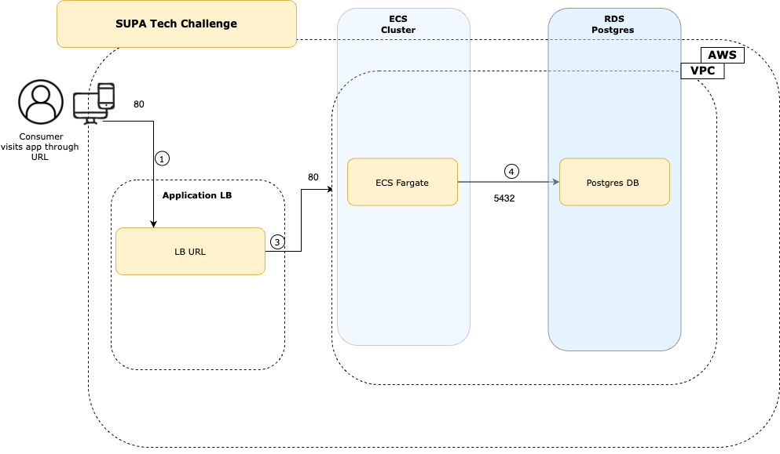

# SUPA tech Challenge

## Application Architecture




## AWS Cloud Deployment

### Prerequisites

Before deploying the AWS CDK project, ensure the following prerequisites are met:

- **AWS Account**: You must have an AWS account with appropriate permissions to create AWS resources.
- **AWS CLI**: Install and configure the AWS Command Line Interface (CLI) with access to your AWS account.
- **Node.js and npm**: Install Node.js and npm on your local development machine.
- **AWS CDK**: Install the AWS Cloud Development Kit (CDK) globally using npm.

## Getting Started

To get started, follow these steps:

1. **Clone the Repository**: Clone the repository containing the AWS CDK TypeScript project to your local machine:

    ```bash
    git clone https://github.com/Rajeshsupreet/supa_code_challenge.git
    ```

2. **Navigate to Project Directory**: Change into the directory of your AWS CDK project:

    ```bash
    cd supa_code_challenge
    ```

3. **Install Dependencies**: Install project dependencies using npm:

    ```bash
    npm install
    ```

## Deployment

To deploy the AWS CDK TypeScript project, use the following steps:

1. **Synthesize CloudFormation Template**: Generate the CloudFormation template for your AWS CDK project:

    ```bash
    npm run build
    ```

2. **Deploy Stack**: Deploy the AWS CDK stack to your AWS account:

    ```bash
    cdk deploy
    ```

3. **Confirm Deployment**: Review the changes proposed by the AWS CDK deployment. If satisfied, confirm the deployment by typing 'y' and pressing Enter.

4. **Wait for Deployment**: Wait for the deployment process to complete. This may take several minutes depending on the complexity of your infrastructure.

5. **Verify Deployment**: Once the deployment is complete, verify that your AWS resources have been provisioned as expected in the AWS Management Console.

# Technical Challenge URL

To Access Technical Challenge URL depolyed in AWS Cloud:

```shell
http://supaco-myfar-eapr9bpwka0f-1054826663.us-east-1.elb.amazonaws.com/
```

## Cleanup

To avoid incurring unnecessary costs, it's important to clean up AWS resources after you've finished using them. To clean up the resources created by the AWS CDK project, follow these steps:

1. **Destroy Stack**: Destroy the AWS CDK stack and delete the associated resources:

    ```bash
    cdk destroy
    ```

2. **Confirm Destruction**: Review the resources that will be destroyed and type 'y' to confirm the destruction.

3. **Wait for Destruction**: Wait for the destruction process to complete. This may take several minutes.

4. **Verify Deletion**: Verify that the AWS resources have been deleted in the AWS Management Console.

## Security Considerations:

1. The RDS database credentials are stored in AWS Secrets Manager, which provides secure and centralized management.
2. The ECS Fargate service communicates with the RDS instance within the VPC, ensuring network isolation.
3. IAM roles are used to control access to AWS resources.

4. The ECS Fargate service is configured with security groups to restrict access to specific IP ranges or other AWS resources.
5. Ensured proper encryption at rest and in transit for the RDS database.
6. Implemented logging and monitoring for both the ECS service and the RDS database to detect and respond to security incidents.


## Local Deployment

`docker pull servian/techchallengeapp:0.10.0`

### Start server

update `conf.toml` with database settings

`./TechChallengeApp updatedb` to create a database and seed it with test data

`./TechChallengeApp serve` will start serving requests

## Configuration file

The application is configured using a file stored in the root directory of the application. It contains the configuration for the listener as well as the database connectivity details.

Example:

``` toml
"DbUser" = "postgres"
"DbPassword" = "changeme"
"DbName" = "app"
"DbPort" = "5432"
"DbHost" = "localhost"
"DbType" = "postgres"
"ListenHost" = "localhost"
"ListenPort" = "3000"
```

* `DbUser` - the user used to connect to the database server
* `DbPassword` - the password used to connect to the database server
* `DbName` - name of the database to use on the database server
* `DbPort` - port to connect to the database server on
* `DbHost` - host to connect to, ip or dns entry
* `DbType` - type of database to connect to ("postgres" or "boltdb")
* `ListenHost` - listener configuration for the application, 0.0.0.0 for all IP, or specify ip to listen on
* `ListenPort` - port to bind on the local server

## Environment Variables

The application will look for environment variables that are able to override the configuration defined in the `conf.toml` file. These environment variables are prefixed with `VTT` and follow this pattern `VTT_<conf value>`. e.g. `VTT_LISTENPORT`. Note, they are UPPERCASE.

Environment variables has precedence over configuration from the `conf.toml` file
